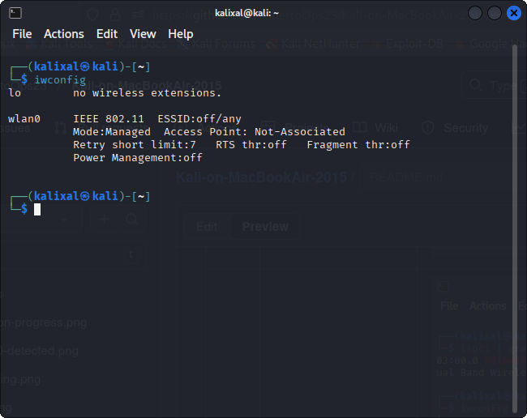

# 💻 Kali-on-MacBookAir-2015 

Documenting my personal experience reinstalling **Kali Linux** on a **MacBook Air (2015, Intel i5)** after a macOS update erased my dual boot setup.  
This project details the installation process, network issues, and how I fixed the Broadcom Wi-Fi driver problem on this specific hardware.

---

## 🧠 Project Overview

After updating macOS, my Kali Linux partition disappeared.  
I decided to reinstall Kali from scratch using a USB created on my Windows PC (Rufus).  

This repository documents:
- The exact steps I followed during the reinstall.
- How I handled the **“no network”** issue during setup.
- The commands I used to fix the **Broadcom BCM4360** Wi-Fi driver.
- How I got internet back using an **iPhone USB hotspot**.

---

## 🧰 System Information

| Component | Details |
|------------|----------|
| **Device** | MacBook Air (Early 2015) |
| **CPU** | Intel i5 |
| **Wi-Fi Chip** | Broadcom BCM4360 802.11ac |
| **Boot Setup** | Dual Boot (macOS + Kali Linux) |
| **Installer** | Rufus (Windows) |
| **Desktop Environment** | XFCE with All Tools |

---

## ⚙️ Key Fix

After installation, Kali didn’t detect any Wi-Fi networks.  
Here’s the fix that worked for me:

```bash
sudo apt install linux-image-amd64 linux-headers-amd64
sudo reboot
```
---

## 📸 Screenshots

| Description | Preview |
|--------------|----------|
| Kali graphical installation screen |  |
| No network detected during install |  |
| Identifying Broadcom BCM4360 adapter |  |
| Wi-Fi successfully connected after fix |  |
